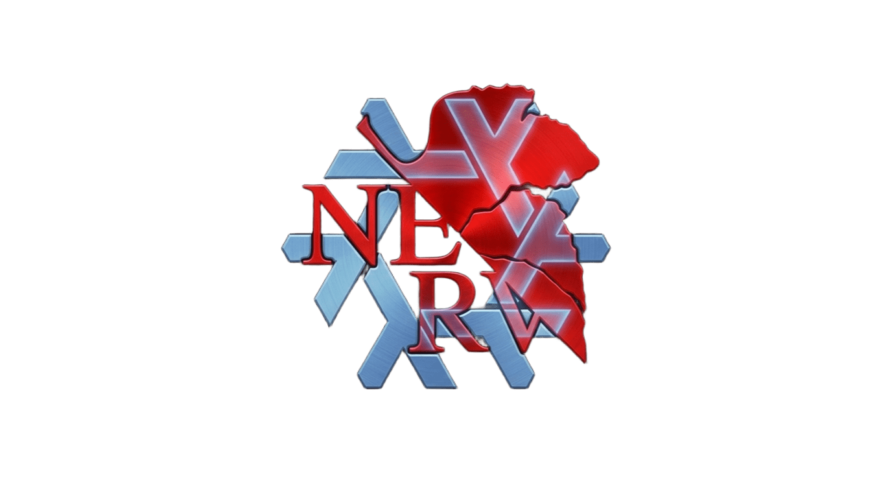

<p align="center">
  
</p>

<h1 align="center">NERV.nixos</h1>

<p align="center">
  An opinionated, composable NixOS base library — declare your machine identity, get a hardened system out of the box.
</p>

---

## What is NERV.nixos?

NERV.nixos is a NixOS flake that provides hardened system defaults as composable modules. Instead of managing a monolithic `configuration.nix`, you write a minimal host file that declares only what is specific to your machine — CPU, GPU, hostname, locale, disk device — and inherit a secure, well-documented system automatically.

**Core principle:** you declare machine-specific parameters; NERV handles the rest.

Every security-critical subsystem (kernel hardening, AppArmor, auditd, ClamAV, AIDE, full-disk encryption, Secure Boot) is always-on and opaque by design. Optional services (SSH, audio, bluetooth, printing, ZSH) are disabled by default and activated per-host with a single `enable = true`. All user-facing knobs live under a typed `nerv.*` option namespace — no guessing, no copy-paste configs.

### What NERV provides

- Hardened Zen kernel with memory, CPU, and network security parameters
- Full disk encryption via LUKS, declaratively provisioned by Disko
- Secure Boot via Lanzaboote with automatic TPM2 LUKS bind across two boot stages
- AppArmor, auditd, ClamAV, and AIDE file integrity monitoring — always on
- SSH daemon hardened with endlessh tarpit and fail2ban with exponential ban growth
- PipeWire audio stack with low-latency defaults, AirPlay sink, and ALSA/PulseAudio compat
- Bluetooth (OBEX), printing (CUPS + Avahi), ZSH with autosuggestions and fzf
- Impermanence — `btrfs` mode uses BTRFS rollback to reset `/` on every boot; `full` mode wipes `/` on reboot via tmpfs
- Home Manager NixOS wiring — each user owns `~/home.nix`; NERV imports it automatically
- Typed `nerv.*` NixOS module options for every user-configurable parameter

### What NERV does NOT provide

- DE/WM/DM configuration — belongs in your host flake
- Home Manager dotfiles — you own `~/home.nix`; NERV only wires it in
- Multi-user example templates — covered by the two built-in profiles

---

## Profiles

Two profiles are defined in `flake.nix`. Pick the one that matches your target:

| Profile  | Use case          | Key differences                                                              |
|----------|-------------------|------------------------------------------------------------------------------|
| `host`   | Desktop / laptop  | Audio, Bluetooth, printing, Lanzaboote, BTRFS impermanence (rollback on boot)|
| `server` | Headless server   | SSH only, LVM layout, full impermanence (`/` as tmpfs, state on `/persist`)  |

---

## Installation

### A — New system (NixOS Live ISO, LVM layout)

```bash
# 1. Boot the NixOS minimal ISO and get a root shell.

# 2. Clone NERV.nixos into the standard NixOS config location.
mkdir -p /mnt/etc/nixos
git clone https://github.com/atirelli3/NERV.nixos.git /mnt/etc/nixos
cd /mnt/etc/nixos

# 3. Provision the disk (THIS WILL ERASE THE TARGET DISK).
nix --experimental-features "nix-command flakes" run github:nix-community/disko/v1.13.0 -- \
  --mode destroy,format,mount hosts/disko-configuration.nix

# 4. Generate hardware configuration and copy it into place.
nixos-generate-config --no-filesystems --root /mnt
cp /mnt/etc/nixos/hardware-configuration.nix hosts/hardware-configuration.nix

# 5. Edit hosts/configuration.nix — fill every PLACEHOLDER value.
nano hosts/configuration.nix

# 6. Install.
nixos-install --flake /mnt/etc/nixos#host   # or #server
```

### B — New system (BTRFS layout)

> **Mandatory:** step 5 creates `@root-blank`. The initrd rollback service snapshots `@root-blank → @` on every boot. Skipping this step causes a first-boot failure.

```bash
# 1. Boot the NixOS minimal ISO and get a root shell.

# 2. Clone NERV.nixos.
mkdir -p /mnt/etc/nixos
git clone https://github.com/atirelli3/NERV.nixos.git /mnt/etc/nixos
cd /mnt/etc/nixos

# 3. Provision the disk.
nix --experimental-features "nix-command flakes" run github:nix-community/disko/v1.13.0 -- \
  --mode destroy,format,mount modules/system/disko.nix

# 4. Create the rollback baseline — MANDATORY.
btrfs subvolume snapshot -r /mnt/@ /mnt/@root-blank

# 5. Generate and copy hardware configuration.
nixos-generate-config --no-filesystems --root /mnt
cp /mnt/etc/nixos/hardware-configuration.nix hosts/hardware-configuration.nix

# 6. Edit hosts/configuration.nix — fill every PLACEHOLDER value.
nano hosts/configuration.nix

# 7. Install.
nixos-install --flake /mnt/etc/nixos#host
```

### C — Existing NixOS system

```bash
# 1. Back up your current config.
sudo cp -r /etc/nixos /etc/nixos.bak

# 2. Clone NERV.nixos.
sudo git clone https://github.com/atirelli3/NERV.nixos.git /etc/nixos
cd /etc/nixos

# 3. Copy your existing hardware configuration.
sudo cp /etc/nixos.bak/hardware-configuration.nix hosts/hardware-configuration.nix

# 4. Edit hosts/configuration.nix — fill every PLACEHOLDER value.
sudo nano hosts/configuration.nix

# 5. Switch to NERV.
sudo nixos-rebuild switch --flake /etc/nixos#host
```

### D — Enabling Secure Boot (post-install)

Secure Boot is disabled by default. Enable it after the system is installed and booting correctly.

```bash
# 1. Enter UEFI Setup Mode — clear all Secure Boot keys in firmware settings.

# 2. Enable in hosts/configuration.nix:
nerv.secureboot.enable = true;

# 3. Rebuild.
sudo nixos-rebuild switch --flake /etc/nixos#host

# Boot 1: keys enrolled automatically, machine reboots.
# Boot 2: LUKS bound to TPM2 — unlocks automatically from this point on.
```

> See [Secure Boot documentation](docs/modules/secureboot.md) for full details and recovery procedures.

### Applying changes

```bash
# Standard rebuild
sudo nixos-rebuild switch --flake /etc/nixos#host

# With Home Manager (required when nerv.home.enable = true)
sudo nixos-rebuild switch --flake /etc/nixos#host --impure
```

---

## Module Overview

### System modules — always active

| Module | File | Purpose |
|---|---|---|
| Identity | `modules/system/identity.nix` | Hostname, locale, primary user group wiring |
| Hardware | `modules/system/hardware.nix` | CPU microcode, GPU drivers, firmware, TRIM |
| Kernel | `modules/system/kernel.nix` | Zen kernel, sysctl hardening, module blacklist |
| Security | `modules/system/security.nix` | AppArmor, auditd, ClamAV, AIDE |
| Nix | `modules/system/nix.nix` | Daemon config, GC, store optimisation, auto-upgrade |
| Boot | `modules/system/boot.nix` | systemd-boot, EFI, initrd |
| Disko | `modules/system/disko.nix` | Declarative disk layout (BTRFS or LVM) |
| Impermanence | `modules/system/impermanence.nix` | BTRFS rollback or tmpfs root, bind-mount persistence |
| Secure Boot | `modules/system/secureboot.nix` | Lanzaboote + automatic TPM2 LUKS bind |

### Service modules — opt-in

| Module | Option | Purpose |
|---|---|---|
| OpenSSH | `nerv.openssh.enable` | SSH daemon + endlessh tarpit + fail2ban |
| PipeWire | `nerv.audio.enable` | Audio stack (ALSA, PulseAudio compat, AirPlay) |
| Bluetooth | `nerv.bluetooth.enable` | BlueZ + OBEX + MPRIS proxy |
| Printing | `nerv.printing.enable` | CUPS + Avahi network discovery |
| ZSH | `nerv.zsh.enable` | ZSH shell with plugins (enabled by default) |

---

## Configuration

All machine-specific values live in `hosts/configuration.nix`. Replace every `PLACEHOLDER`:

```nix
nerv.hostname    = "my-desktop";
nerv.primaryUser = [ "alice" ];

nerv.hardware.cpu = "amd";    # "amd" | "intel" | "other"
nerv.hardware.gpu = "nvidia"; # "amd" | "nvidia" | "intel" | "none"

nerv.locale.timeZone      = "Europe/Rome";
nerv.locale.defaultLocale = "en_US.UTF-8";
nerv.locale.keyMap        = "us";

nerv.disko.layout = "btrfs"; # "btrfs" | "lvm"

disko.devices.disk.main.device = "/dev/nvme0n1";

users.users.alice = { isNormalUser = true; };
system.stateVersion = "25.11";
```

Any hardcoded setting can be overridden with `lib.mkForce`:

```nix
# hosts/configuration.nix
{ lib, ... }: {
  hardware.nvidia.open       = lib.mkForce false;  # Maxwell/Pascal GPUs
  boot.kernelPackages        = lib.mkForce pkgs.linuxPackages_hardened;
}
```

---

## Documentation

| Document | Description |
|---|---|
| [Installation guide](docs/installation.md) | Full install procedures for all scenarios |
| [Configuration reference](docs/configuration.md) | All `nerv.*` options in one place |
| [Architecture](docs/architecture.md) | How modules compose, data flow, design decisions |
| [Home Manager](docs/home-manager.md) | Per-user `~/home.nix` wiring |
| **System modules** | |
| [Identity](docs/modules/identity.md) | `nerv.hostname`, `nerv.locale.*`, `nerv.primaryUser` |
| [Hardware](docs/modules/hardware.md) | CPU microcode, GPU drivers, firmware |
| [Kernel](docs/modules/kernel.md) | Zen kernel, sysctl hardening, module blacklist |
| [Security](docs/modules/security.md) | AppArmor, auditd, ClamAV, AIDE |
| [Nix](docs/modules/nix.md) | Daemon, GC, auto-upgrade |
| [Boot](docs/modules/boot.md) | systemd-boot, initrd |
| [Disko](docs/modules/disko.md) | BTRFS and LVM disk layouts |
| [Impermanence](docs/modules/impermanence.md) | State persistence strategies |
| [Secure Boot](docs/modules/secureboot.md) | Lanzaboote + TPM2 auto-unlock |
| **Service modules** | |
| [OpenSSH](docs/services/openssh.md) | SSH daemon, tarpit, fail2ban |
| [PipeWire](docs/services/pipewire.md) | Audio stack, AirPlay |
| [Bluetooth](docs/services/bluetooth.md) | BlueZ, OBEX, MPRIS |
| [Printing](docs/services/printing.md) | CUPS, Avahi |
| [ZSH](docs/services/zsh.md) | Shell, plugins, aliases |

---

## Repository Layout

```
nerv.nixos/
├── flake.nix                    # inputs, profiles (host/server), nixosModules, nixosConfigurations
├── hosts/
│   ├── configuration.nix        # machine identity — edit this
│   └── hardware-configuration.nix  # replace with nixos-generate-config output
├── modules/
│   ├── default.nix              # aggregates system + services + home
│   ├── system/
│   │   ├── identity.nix         # hostname, locale, primaryUser
│   │   ├── hardware.nix         # cpu/gpu enum options
│   │   ├── kernel.nix           # Zen kernel + hardening params
│   │   ├── security.nix         # AppArmor, auditd, ClamAV, AIDE
│   │   ├── nix.nix              # daemon, GC, optimise, autoUpgrade
│   │   ├── boot.nix             # layout-agnostic initrd + bootloader
│   │   ├── secureboot.nix       # Lanzaboote + TPM2
│   │   ├── disko.nix            # disk layout (btrfs/lvm), LUKS, initrd services
│   │   └── impermanence.nix     # BTRFS or full impermanence mode
│   └── services/
│       ├── openssh.nix          # SSH + endlessh + fail2ban
│       ├── pipewire.nix         # audio stack
│       ├── bluetooth.nix        # BT + OBEX
│       ├── printing.nix         # CUPS + Avahi
│       └── zsh.nix              # ZSH + plugins
└── home/
    └── default.nix              # Home Manager NixOS wiring
```
